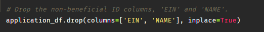
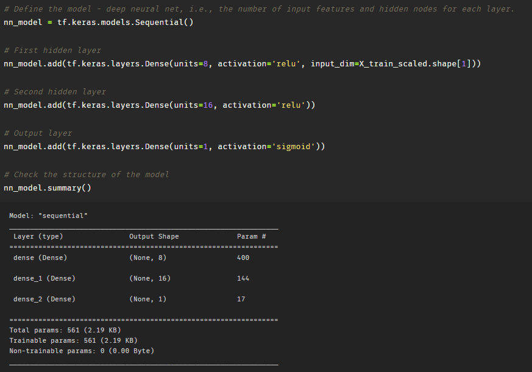
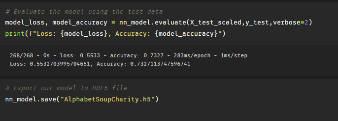
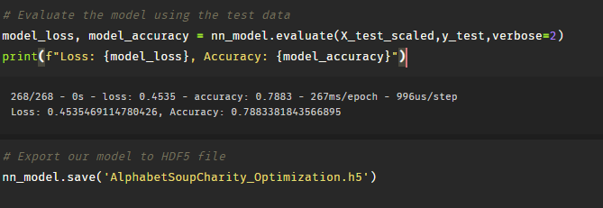

# Deep-Learning-Challenge

# Overview of the Analysis: 

In this deep learning challenge, the primary objective is to develop a powerful predictive model using a deep neural network to determine the success of funding requests made by charitable organizations. The analysis aims to use data from the 'charity_data.csv' file to train the model and make predictions.

# Files in Repository

- **AlphabetSoupCharity.ipynb**
  This is the original Jupyter Notebook file that contains the code for the first model implementation.

- **AlphabetSoupCharity.h5**
  This H5 file contains the original model saved after training.

- **AlphabetSoupCharity_Optimization.ipynb**
  This Jupyter Notebook file represents the modified version of the original code with optimizations to achieve the 75% threshold requirement.

- **AlphabetSoupCharity_Optimization.h5**
  This H5 file corresponds to the optimized version of the model, saved after training with the improvements you made.

- **Written Analysis.pdf**
  This file contains the written report on the Neural Network Model, providing a detailed analysis of the project.

- **images**
  This contains images for the preprocessing, compiling, training, evaluation, and optimizing the model.

# Data Preprocessing

### What variable(s) are the target(s) for your model?

The target variable, 'IS_SUCCESSFUL', contains binary labels stating whether a charitable organization's funding request achieved success (1) or not (0).

### What variable(s) are the features for your model?
The features include:

- APPLICATION_TYPE: Alphabet Soup application type.
- AFFILIATION: Affiliated sector of industry.
- CLASSIFICATION: Government organization classification.
- USE_CASE: Use case for funding.
- ORGANIZATION: Organization type.
- INCOME_AMT: Income classification.
- SPECIAL_CONSIDERATIONS: Special considerations for application.
- ASK_AMT: Funding amount requested.
- IS_SUCCESSFUL: Was the money used effectively.

### What variable(s) should be removed from the input data because they are neither targets nor features?
Two irrelevant variables were removed: 'EIN' (Employer Identification Number) and 'NAME'. These columns served solely for identification purposes and did not contribute to the predictive power of the model.

# Compiling, Training, and Evaluating the Model

### How many neurons, layers, and activation functions did you select for your neural network model, and why?
In designing the neural network, careful consideration was used to strike the ideal balance between complexity and avoiding overfitting. After an analysis of the data, we opted for a three-layer architecture.

• The first hidden layer comprises 8 neurons, while the second hidden layer contains 16 neurons. These neuron numbers were strategically chosen to optimize model performance. Ten features were used.

• The use of three layers ensured that we achieved the best accuracy without the risk of overfitting.

• To introduce non-linearity into the network, the 'relu' activation function was used for the first and second hidden layers. The 'sigmoid' activation function was used for the output layer, which aligns with our binary classification problem.

### Were you able to achieve the target model performance?
On our first attempt, an accuracy of 73.27% was achieved. 

By incorporating the 'NAME', applying appropriate binning techniques, model performance improved. Through experimentation, an accuracy of 78.83% was achieved in the end. 

### What steps did you take in your attempts to increase model performance?
An array of methodologies was used to try and improve the model. Experiments with LeakyReLU as an activation function did not yield the desired impact. Adjusting the number of neurons and experimentation with different epochs also failed to improve performance. At first, ten epochs were used to see results, then gradually were increased to as high as 100 before settling to 50 as a good median. Dropping additional columns also led to a decrease in performance. Keeping the 'NAME' column led to the model hitting the targeted accuracy.

# Summary: 
### Summarize the overall results of the deep learning model. Include a recommendation for how a different model could solve this classification problem, and then explain your recommendation.

The overall results of the deep learning model are that it achieved an accuracy of 78.83% in predicting the success of funding requests for charitable organizations. The model was designed with three layers, 8 and 16 neurons in the first and second hidden layers, respectively, and appropriate activation functions to strike a balance between complexity and overfitting. The inclusion of the 'NAME' column upping the features to eleven and utilizing binning techniques contributed significantly to the model's improved performance.

A different model, such as a machine learning model like Random Forest, could be a potential solution for this classification problem due to its strengths in addressing specific challenges. With a focus on interpretability, effective handling of non-linearity, and accommodation of imbalanced data, while also being computationally efficient, Random Forest might be a suitable choice for the task.
